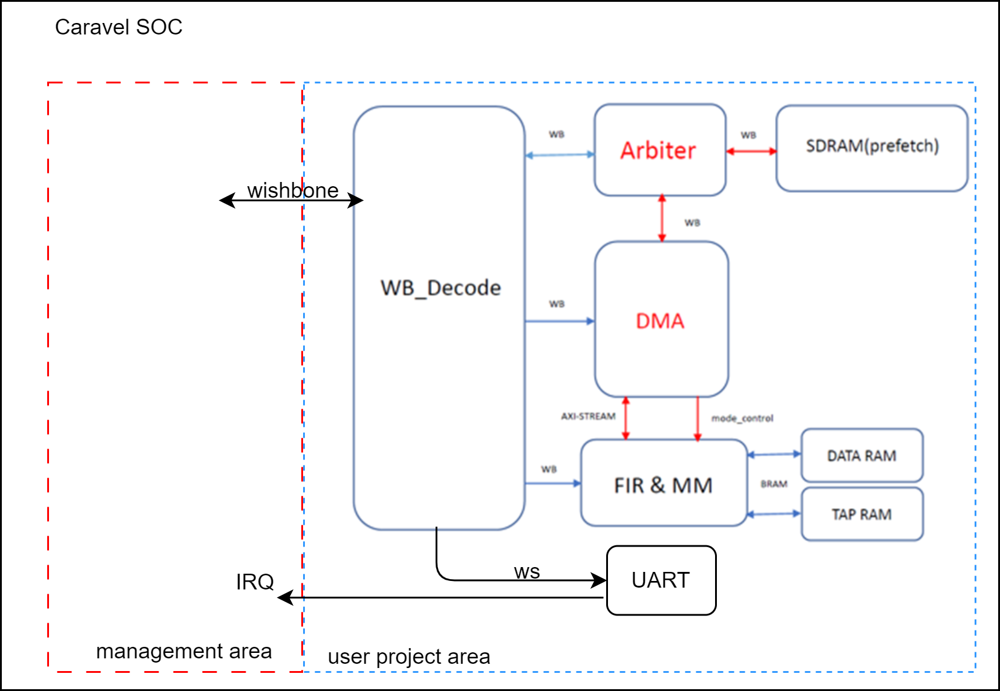
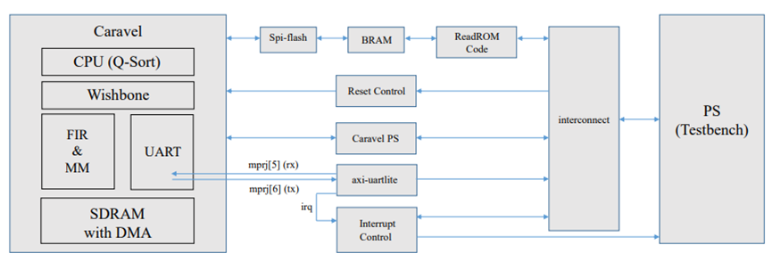

# WorkLoad Optimize SOC (WLOS)

## About this project
Caravel SOC with four tasks: FIR, matrix multiplication, quick sort, and UART loopback.

### Our design

- Since FIR and matrix multiplication both need multiply-add operation and doing multiplication using softare is very slow (150+ cycles for a 32-bit multiplication), we design a accelerator that can do both FIR and matrix multiplication.
- Quick sort is done by CPU.
- UART loopback is handled by CPU. When the uart hardware receives a new data, it will send interrupt request to CPU. Then the CPU will read back the data and send it out.
- We also implemented a arbiter and a DMA so that the accelerator can fetch data from memory while the CPU is doing quick sort
- SDRAM with prefetch functionality (4 banks).
- We also modified `crt0_Vex.S` and `sections.lds` to put the data and program at our desired position in the SDRAM.


### Simulation for all workload
```sh
cd ~/SOC-final-project/testbench/all
source run_clean
source run_sim
```

### Simulation for matrix multiplication(software)
```sh
cd ~/SOC-final-project/testbench/counter_la_mm
source run_clean
source run_sim
```

### Simulation for FIR(software)
```sh
cd ~/SOC-final-project/testbench/counter_la_fir
source run_clean
source run_sim
```

### Simulation for qsort(software)
```sh
cd ~/SOC-final-project/testbench/counter_la_qs
source run_clean
source run_sim
```

### Simulation for uart(software)
```sh
cd ~/SOC-final-project/testbench/uart
source run_clean
source run_sim
```

## Verification with FPGA

### Synthesis and Generate bitstream
```sh
cd ~/SOC-final-project/vivado
source run_vivado
```


